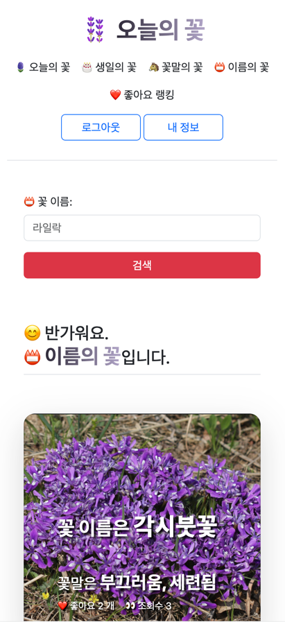

# 🪻 [오늘의 꽃](https://2dayflower.com/)
## 목차
* 개요
* 적용 기술
* 기능
* DB

## 목적
* 공공 데이터(농촌진흥청 국립원예특작과학원)를 이용하여 꽃을 검색할 수 있는 웹 서비스
* 능숙하지 않은 기술을 연습하고, 개발/배포/운영 경험을 목적으로 개인프로젝트를 진행함

## 적용 기술

  

  

 

## 도메인
[오늘의 꽃](https://2dayflower.com)

## 화면

## 기능
### 회원
`FormLogin` 방식과 `OAuth2Login` 방식을 병행함
* 일반 회원가입
* 소셜 회원가입
  * 카카오톡
* 아이디 찾기
* 비밀번호 찾기
  * smtp 활용
  * 비동기 방식으로 구현함
* 내 정보
* 회원탈퇴
* 이메일 변경
* 비밀번호 변경
  * 일반 회원만 가능
* 로그인
* 로그아웃

### 꽃
* 오늘의 꽃
  * 오늘 날짜를 기준으로 꽃 조회
* 생일의 꽃
  * 생일로 꽃 조회
* 꽃말의 꽃
  * 꽃말로 꽃 조회
* 이름의 꽃
  * 이름으로 꽃 조회
* 좋아요 랭킹
  * 좋아요 내림차순으로 꽃 조회
* 좋아요
  * `Ajax`를 활용하여 구현
* 좋아한 꽃
  * 회원이 좋아요 누른 꽃 조회

## DB

